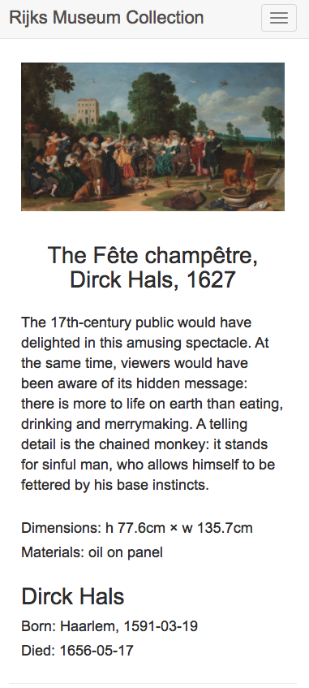
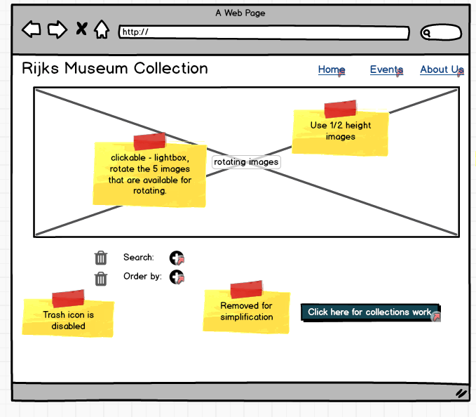
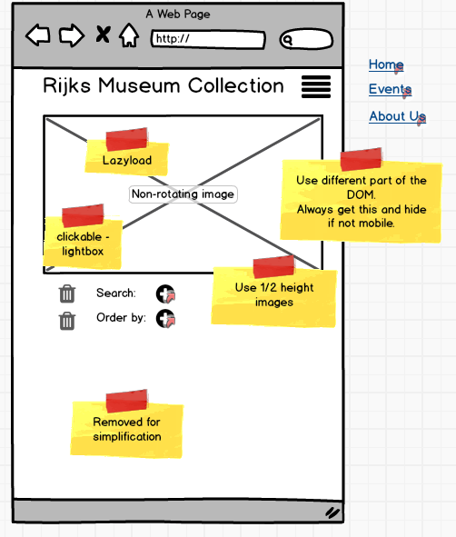
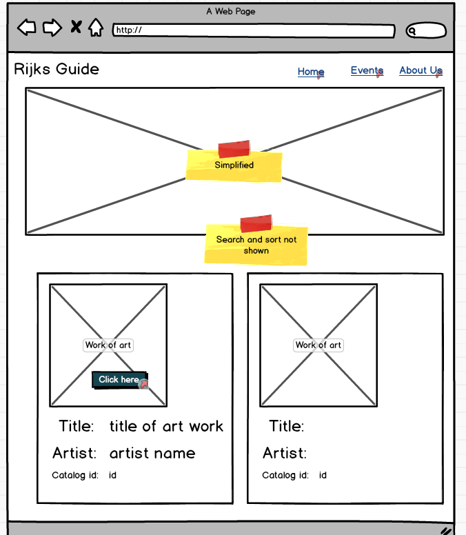

# Rijks Museum Collection

See some of the wonders of the art world.
A magnificent art museum and collection at your fingertips.


Choose an artwork to discover the details.


Fully responsive:




## Live Site
You can access the [Rijks Museum Collection](https://jv2351.github.io/rijksmuseum) at https://jv2351.github.io/rijksmuseum

## Wireframes
The wiresframes were built using [Balsamiq](https://balsamiq.com). They can found at ./diagrams/rijksmuseum-1.bmpr. Using Balsamiq, it is possible to 'walk the application' in Full Screen Presentation mode.

Some of the wireframes are shown below.





## Technical
The technologies used are Html5, CSS, Bootstrap, Sass, Javascript, jQuery and Fancybox.

### Rijks Museum API
The [Rijks Museum Website](https://www.rijksmuseum.nl/en) is a beautiful website.

[Rijksmuseum API](https://www.rijksmuseum.nl/en/api) is the main link. To use this API it is necessary to first obtain a key. [RijksStudio](https://www.rijksmuseum.nl/en/rijksstudio) and Login. Create a new account and request a key.

[Rijksmuseum API Documentation](http://rijksmuseum.github.io)
is an excellent source of information on API usage.

[Rijksmuseum API Demos](https://rijksmuseum.github.io/demos) has some excellent examples.

### Sass Compiler
./collection/resources/sass-compiler is a script to compile SCSS files to css.

### Node HTTP Server
Script to install and/or start.

```
#!/bin/sh
#
# script to create and start a node http server
#
# ref:
# https://www.npmjs.com/package/http-server
#

echo "Script to create and start a node http server"
echo " "
PORT=$1
if [ -z "$PORT" ]; then
    echo "Usage: node-http-server port"
    exit 1
fi
#
# check whether jitsu is installed
#
if [ ! -f "/usr/local/bin/jitsu" ]; then
    echo "Installing jitsu."
    npm install jitsu -g
fi
#
CURRENT_DIR="`pwd`"
NODE_SERVER_DIR="`pwd`/http-server"
echo "http-server directory: $NODE_SERVER_DIR port: $PORT"
#
echo "Checking if node server directory $NODE_SERVER_DIR already exists"
if [ ! -d "$NODE_SERVER_DIR" ]; then
#
# install http-server
#
    echo "Creating node server at http-server"
    jitsu install http-server
fi
#
echo "cd to http-server"
cd http-server

#
# starting the server
#
pwd
echo "Starting the http-server, caching turned off"
node bin/http-server -p $PORT -c-1 $CURRENT_DIR
#
# done
#
echo " "
echo "Completed"
#

```

To start an instance of the HTTP Server:

```
node-http-server 8080
```

